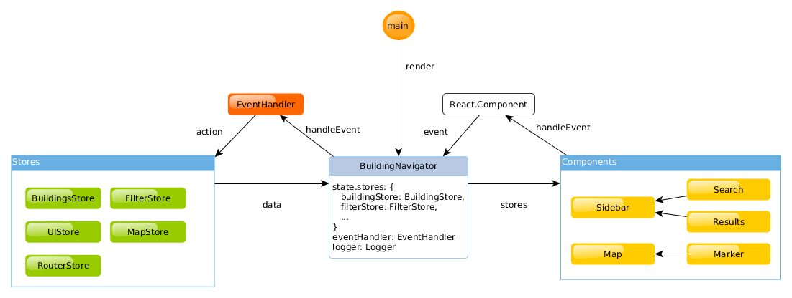

# Building Navigator

This tool provides an interactive map with accessible information about places in Leipzig. You can search for certain places or filter them. Later means, that you provide certain requirements, such as lift needs to be suitable for wheelchairs, and the tool will display only buildings which match these.

**Important:** This tool is under heavy development, we are currently in [round 3](https://github.com/AKSW/building-navigator/projects/2) of the project, focusing on refinement and UI improvements. Furthermore supporting screenreaders and text-to-speech software is also one of the primary objectives.

**Screenshot:**


## The team behind the scene

This tool is being developed by [Simeon Ackermann](https://github.com/simeonackermann) and [Konrad Abicht](https://github.com/k00ni) as part of the [LEDS-project](http://www.leds-projekt.de/de/linked-enterprise-data-services.html). We work together with the [Behindertenverband Leipzig e.V.](http://www.le-online.de/), a non-profit organization located in Leipzig, which cares about issue of disabled people.

## For developers

### HowTo Run

Checkout this repository and open the `dist/index.html` file into your browser.

### Compatibility

Promises: http://caniuse.com/#feat=promises

### Accessibility

Callbacks instead Promise

https://facebook.github.io/react-native/docs/accessibility.html

### Architecture and software details



The architecture can separated into three parts: view, api, store. The view is splitted into React containers for logical events and components with HTML output.

All events goes to the action api to create SPARQL requests, get results, set current filters etc. 

The store are two parts: firstly the RDFStore which imports our RDF data and is used for SPARQL requests to filter places. Secondly the Redux store holds our app states like currently visible markers, filter and map settings. theses states are subscribed from the view to automatically update the frontend.

### Folder structure

```
* assets/
    - db.ttl
    - images
* dist/
    - index.html
    - app.min.js
    - favicon.ico
* docs/
* node_modules (NPM packages)
* src/
    - actions/ (API actions)
    - components/ (HTML components)

        + [ComponentName].js
    - containers/ (logical container)
        + [LogicalName]Container.js
    - reducers/ (Redux stores)
    - middlerware/ (API)
* test/
    - [Name].test.js
* README.md
* package.json
* webpack.config.js
```

### Required libraries

- ReactJS as main JS UI library
- Redux as store extension
- ImmutableJS for immutable objects (List, Map, ...)
- Material UI
- Logging: redux-logger
- Jest and Enzyme for testing
- redux-thunk for asynchronous middleware
- react-leaflet as Leaflet plugin
- react-router to route
- raw-load to load the RDFile


### Tests

All tests are under `./test/` and executed via `npm test`.

Tests are currently not supported.


### Developing

As developing environment we use a Docker container with Node.js, NPM, Webpack etl. al. from: https://github.com/Dockerizing/NodeJS-NPM-ECMA6-Stack

Mount this project into the container and access http://localhost:8080.

### Create Production

To create the production files in `./dist/` exec into the Docker container and run:

    npm run build-dist
