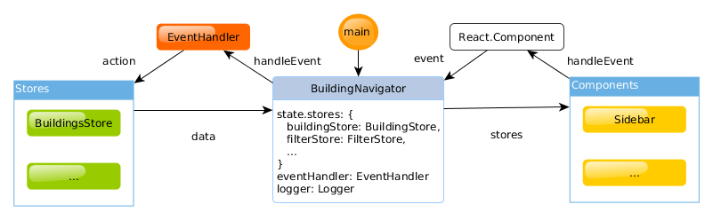

# Building Navigator

Interactive map with accessible information about places in Leipzig.

## Note

- Requires Virtuoso 7 with > SPARQL 1.1
- Allow Cross-Origin requests in Virtuoso

## Compatibility

Promises: http://caniuse.com/#feat=promises

## Accessibility

Callbacks instead Promise

https://facebook.github.io/react-native/docs/accessibility.html

## Architecture and software details



The architecture can separated into three parts: view, api, store. The view is splitted into React containers for logical events and components with HTML output.

All events goes to the action api to create SPARQL requests, get results, set current filters etc. 

The store are two parts: firstly the RDFStore which imports our RDF data and is used for SPARQL requests to filter places. Secondly the Redux store holds our app states like currently visible markers, filter and map settings. theses states are subscribed from the view to automatically update the frontend.

### Folder structure

```
* assets/
    - db.ttl
    - images
* dist/
    - index.html
    - app.min.js
    - favicon.ico
* docs/
* node_modules (NPM packages)
* src/
    - actions/ (API actions)
    - components/ (HTML components)

        + [ComponentName].js
    - containers/ (logical container)
        + [LogicalName]Container.js
    - reducers/ (Redux stores)
    - middlerware/ (API)
* test/
    - [Name].test.js
* README.md
* package.json
* webpack.config.js
```

## Required libraries

- ReactJS as main JS UI library
- Redux as store extension
- ImmutableJS for immutable objects (List, Map, ...)
- Material UI
- Logging: redux-logger
- Jest and Enzyme for testing
- redux-thunk for asynchronous middleware
- react-leaflet as Leaflet plugin
- react-router to route
- raw-load to load the RDFile


## Tests

All tests are under `./test/` and executed via `npm test`.


## Developing

As developing environment we use a Docker container with Node.js, NPM, Webpack etl. al. from: https://github.com/Dockerizing/NodeJS-NPM-ECMA6-Stack
