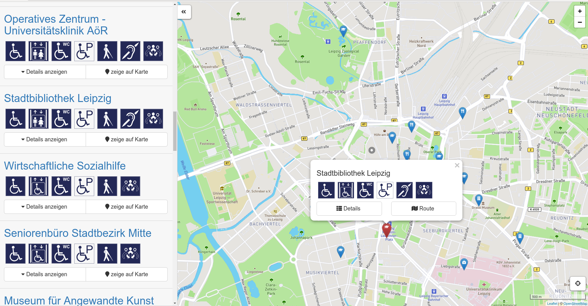

# Gebäude-Navigator

**The Gebäude-Navigator helps you to find accessible places in Leipzig.** You can define restrictions such as accessibility requirements for the entrance, the lift or the toilet. Your selection may lead to a result list. Results can be displayed on a map. Besides restrictions you can also use a keyword search.

**Screenshot:**



### Current version

The latestion version of the software runs at:

https://behindertenverband-leipzig.de/gebaeude-navigator

## About us

This tool is being developed by [Simeon Ackermann](https://github.com/simeonackermann) and [Konrad Abicht](https://github.com/k00ni) as part of the [LEDS-project](http://www.leds-projekt.de/de/linked-enterprise-data-services.html). We work close together with the [Behindertenverband Leipzig e.V.](http://www.le-online.de/), a non-profit organization located in Leipzig, which cares about issue of disabled people. Since January 2018 City of Leipzig joined us.


## Accessibility icons

We use accessibility from this source:

https://teilhabeplan.behindertenverband-leipzig.de/piktogramme.php

Its licensed on the terms of CC BY 4.0.

## How to control the tool, when using one of these screenreaders

**TalkBack** for Android with ChromeMobile
+ Tab-Control with swipe left/right for next element
+ Change tab-filigranity with swipe up or down
+ Apply selected element with double-tab (somewhere on the screen)

**ChromeVox** Extension for Chrome
+ Control with Tabulator (next sibling element) and Str+Arrow-Keys (next child element)
+ Change select-filter with arrow keys, checkboxes with space
+ Select Links Enter, Buttons Space or Enter
+ Scroll with two fingers (a quite sound gives the position by a pitch level)

**COBRA** (Windows), **NVDA** (Windows), **Orca** (Linux with eSpeak)
+ Control with Tabulator to select links or headings
+ Select links or buttons with Space or Enter
+ Use Arrow-Keys to read content

## For developers

This section is for people who want to dive into the code.

### HowTo Run

Checkout this repository and open the `dist/index.html` file into your browser.

If you want to adapt the code and see your changes, you can use our Docker container setup (link below).

### Architecture and software details


The architexture is inspired by Redux/Flux and implements a simple data-event flow.

The main class `BuildingNavigator` holds the stores as state and passes them to the rendered components. It also passes events from the components to the `EventHandler`.

All components extends the `React.Component`, output some html and can hold passed props as local states.

To handle an event, the components can call `super.handleEvent(event)` to execute an action in the `EventHandler`. The action calls a method in a store to change some data.

After changing data in a store the `BuildingNavigator` re-renders all components with the new data.

### Folder and file structure

```
* __mocks__                     // mocked methods for testing
* assets/                       // repository files
* dist/                         // ready to run software
    - webfonts/
    - images/
    - libraries/                // external css libraries
    - favicon.ico
    - index.html
    - main.min.js
    - main.min.js.map
    - style.css
* src/
    - components/               // view components, seperated into subfolders
        + map/
        + sidebar/
        + Map.js
        + Sidebar.js
    - stores/                   // BuildingStore, FilterStore etc.
    - utils/                    // additional utilities
    - BuildingNavigator.js      // main controler class
    - EventHandler.js           // event handler class
    - main.js                   // entry point
    - config.js            
* test/                         // test environment
* README.md
* package.json                  // npm configuration
* webpack.config.js             // webpack configuration for development
* webpack.production.config.js  // webpack configuration for production
```


### Develop environment

As develop environment we use a Docker container with Node.js, NPM, Webpack etl. al. from: https://github.com/AKSW/building-navigator-docker

To setup the development environment follow the instructions in its `README.md`.

#### Test

We use Jest and Enzyme for React GUI tests, and Sinon for asynchronous tests. All current tests are in `./tests` and could started in the Docker container with:

    npm test

#### Code Coverage

Code coverage is generated when running the test suite. The report is stored under `./coverage/lcov-report/index.html`


### Create Production

To create the production files in `./dist/` exec into the Docker container and run:

    npm run build
